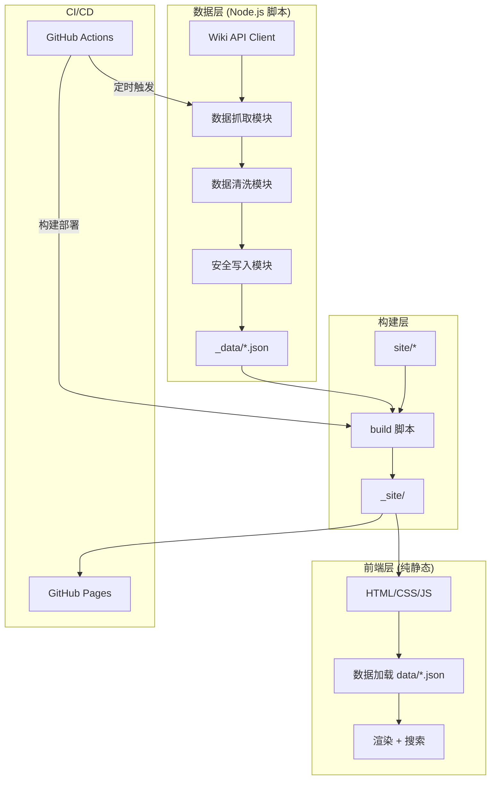
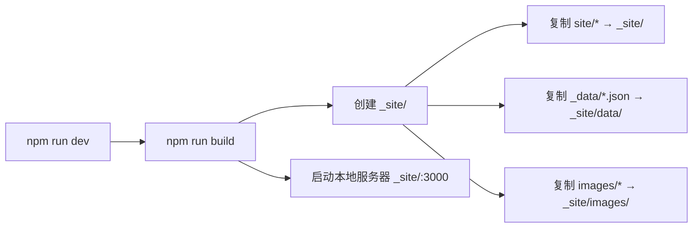

# 技术设计文档：Hot Wheels Hub 全面重构

## 概述

本设计文档描述 Hot Wheels Hub 项目的全面重构方案。项目当前存在多个质量问题：描述文本包含未清洗的 Wiki 标记、新闻 ID 全部为 `rc_undefined`、系列数据为硬编码且链接统一指向首页、图片可能包含占位图、前端数据路径在本地开发时不可用、GitHub Actions 存在并发部署冲突等。

本次重构将抓取脚本从单一 400+ 行文件拆分为模块化架构，修复所有已知数据质量问题，新增搜索功能和新模具展示功能，并统一本地开发与线上部署的数据路径。

### 设计目标

1. **数据质量**：确保所有输出数据干净、完整、无占位图、无 Wiki 标记残留
2. **模块化**：将抓取脚本拆分为独立模块，职责清晰，便于维护和测试
3. **可靠性**：安全写入机制防止空数据覆盖、CI 流程简化消除并发冲突
4. **功能增强**：新增客户端搜索、新模具展示、动态系列数据
5. **开发体验**：统一数据路径，本地开发与线上部署行为一致

## 架构

### 整体架构

项目保持纯静态站点架构，分为三个层次：



### 抓取脚本模块化架构

将 `scripts/scrape.js` 拆分为以下模块：

```
scripts/
├── scrape.js              # 入口文件，编排各模块
├── lib/
│   ├── wiki-client.js     # Wiki API 客户端（HTTP、缓存、并发控制）
│   ├── text-cleaner.js    # Wiki 文本清洗（模板移除、链接转换等）
│   ├── image-utils.js     # 图片 URL 处理（占位图过滤、CDN 格式）
│   ├── scrapers/
│   │   ├── featured.js    # 经典名车抓取
│   │   ├── releases.js    # 新车速递抓取（合并原 newReleases + releases）
│   │   ├── series.js      # 系列数据抓取（动态获取 + 兜底）
│   │   ├── news.js        # 新闻抓取（质量过滤）
│   │   ├── gallery.js     # 图片库抓取
│   │   └── new-castings.js # 新模具抓取
│   └── safe-writer.js     # 安全写入（空数据保护、数量比较）
```

### 前端架构

前端保持纯静态 HTML/CSS/JS，不引入框架。新增搜索模块：

```
site/
├── index.html             # 主页（新增搜索框 + 新模具区域）
├── css/
│   └── style.css          # 样式（新增搜索、新模具相关样式）
└── js/
    ├── app.js             # 主应用（数据加载、渲染）
    └── search.js          # 搜索模块（模糊匹配、防抖、结果渲染）
```

### 构建与部署流程



## 组件与接口

### 1. Wiki API 客户端 (`lib/wiki-client.js`)

负责所有与 Wiki API 的通信，提供缓存和并发控制。

```javascript
/**
 * @typedef {Object} WikiClientOptions
 * @property {number} maxConcurrency - 最大并发请求数，默认 3
 * @property {number} delayMs - 请求间隔毫秒数，默认 500
 * @property {number} maxRetries - 最大重试次数，默认 3
 */

class WikiClient {
  constructor(options = {})

  /** 发起 Wiki API 查询，自动处理分页 */
  async query(params): Promise<any[]>

  /** 解析指定页面，返回 wikitext、HTML、图片列表等 */
  async parsePage(pageIdOrTitle): Promise<ParseResult | null>

  /** 搜索 Wiki 页面 */
  async search(query, limit = 10): Promise<SearchResult[]>

  /** 获取图片信息（带缓存） */
  async imageInfo(filename): Promise<ImageInfo | null>

  /** 获取分类成员 */
  async categoryMembers(category, limit = 50): Promise<CategoryMember[]>

  /** 获取运行统计 */
  getStats(): { totalRequests: number, cacheHits: number, totalTimeMs: number }
}
```

**设计决策**：将 HTTP 请求、重试、缓存、并发控制集中在一个客户端中，所有抓取模块共享同一实例。`imageInfo` 结果在同一次运行中缓存，避免重复请求。并发控制使用简单的信号量模式（最多 3 个并发请求 + 每请求间隔 500ms）。

### 2. 文本清洗模块 (`lib/text-cleaner.js`)

纯函数模块，负责将 Wiki 原始文本转换为干净的纯文本。

```javascript
/**
 * 移除嵌套的 Wiki 模板 {{...}}，使用迭代方式从内层开始
 * 最大迭代深度 10 层，超过则整块移除
 */
function removeTemplates(text): string

/**
 * 将 Wiki 链接转换为纯文本
 * [[Page|Display]] → Display
 * [[Page]] → Page
 */
function convertWikiLinks(text): string

/**
 * 移除外部链接标记，保留显示文本
 * [http://url display text] → display text
 */
function removeExternalLinks(text): string

/**
 * 移除 Wiki 标题标记
 * ==Title== → (空)
 */
function removeHeadings(text): string

/**
 * 移除 HTML 标签和 Wiki 格式标记
 */
function removeHtmlAndFormatting(text): string

/**
 * 移除 Wiki 表格标记
 */
function removeTables(text): string

/**
 * 完整清洗流程：依次执行所有清洗步骤
 * 最终在句子边界处截断到指定长度
 */
function cleanWikiText(text, maxLength = 400): string

/**
 * 从 wikitext 中提取描述（跳过 infobox，取正文前几句）
 */
function extractDescription(wikitext, maxLength = 400): string
```

**设计决策**：所有函数为纯函数，无副作用，便于单元测试和属性测试。嵌套模板使用迭代移除（每次移除最内层 `{{[^{}]*}}`），最多迭代 10 次，超过则用正则强制移除所有残留。

### 3. 图片工具模块 (`lib/image-utils.js`)

```javascript
/** 检查 URL 是否为占位图 */
function isPlaceholderImage(url): boolean

/**
 * 从页面数据中获取最佳可用图片
 * 优先级：infobox image → 页面 images 列表中第一张非占位图 → HTML 中的 img 标签
 * 返回 { thumbUrl, fullUrl } 或 null
 */
async function getBestImage(parsed, wikiClient): Promise<{ thumbUrl: string, fullUrl: string } | null>

/**
 * 清理 Vignette CDN URL，确保获取指定宽度的缩略图
 */
function normalizeImageUrl(url, width = 1200): string
```

**设计决策**：占位图检测通过检查 URL 中是否包含 `Image_Not_Available`（不区分大小写）实现。`wikiImageInfo` 请求 `iiurlwidth=1200` 以获取更高分辨率缩略图。

### 4. 安全写入模块 (`lib/safe-writer.js`)

```javascript
/**
 * 安全写入 JSON 文件
 * - 空数组：跳过写入，输出警告
 * - 数量 < 已有文件的 50%：输出警告但仍写入
 * - 正常情况：直接写入
 * @returns {{ written: boolean, warning: string | null }}
 */
function safeWriteJSON(filePath, data, label): { written: boolean, warning: string | null }
```

### 5. 搜索模块 (`site/js/search.js`)

```javascript
/**
 * 客户端模糊搜索
 * 在所有已加载数据中搜索，支持中英文
 */
class SearchEngine {
  /** 构建搜索索引 */
  buildIndex(allData): void

  /**
   * 执行搜索，返回最多 maxResults 条结果
   * 模糊匹配：将查询拆分为关键词，匹配车型名称、系列名称
   */
  search(query, maxResults = 10): SearchResult[]
}

/**
 * 搜索 UI 控制器
 * 处理输入事件、防抖（300ms）、结果渲染、点击导航
 */
class SearchUI {
  constructor(inputElement, resultsContainer, searchEngine)
  init(): void
}
```

**设计决策**：搜索使用纯客户端实现，不依赖后端。搜索索引在数据加载完成后一次性构建。模糊匹配策略：将查询字符串转为小写后拆分为关键词，检查每个关键词是否出现在车型名称或系列名称中（`includes` 匹配）。结果按匹配关键词数量降序排列。

### 6. 各抓取模块接口

```javascript
// scrapers/featured.js
async function scrapeFeatured(wikiClient): Promise<CarData[]>

// scrapers/releases.js — 合并原 scrapeNewReleases + scrapeReleases
async function scrapeReleases(wikiClient): Promise<{ releases: ReleaseGroup[], newReleases: CarData[] }>

// scrapers/series.js
async function scrapeSeries(wikiClient): Promise<SeriesData[]>

// scrapers/news.js
async function scrapeNews(wikiClient): Promise<NewsItem[]>

// scrapers/gallery.js
async function scrapeGallery(wikiClient): Promise<GalleryImage[]>

// scrapers/new-castings.js
async function scrapeNewCastings(wikiClient): Promise<CastingData[]>
```

## 数据模型

### CarData（车型数据）

```typescript
interface CarData {
  id: string;           // URL 安全的唯一标识，如 "twin_mill"
  name: string;         // 车型名称
  year: number | null;  // 首发年份
  series: string | null;// 所属系列
  number: string | null;// 收藏编号
  color: string | null; // 颜色
  image: string | null; // 缩略图 URL（null 表示无可用图片，绝不使用占位图）
  fullImage: string | null; // 原始图 URL
  description: string;  // 清洗后的纯文本描述（≤400 字符）
  url: string;          // Wiki 页面链接
}
```

### NewsItem（新闻条目）

```typescript
interface NewsItem {
  id: string;           // 唯一 ID，格式 "rc_{revid}" 或 "rc_{encodedTitle}_{timestamp}"
  title: string;        // 标题
  summary: string;      // 摘要（从页面首段提取，非 Wiki 编辑注释）
  date: string;         // 日期 "YYYY-MM-DD"
  source: string;       // 来源
  url: string;          // 链接
  image: string | null; // 配图
}
```

### SeriesData（系列数据）

```typescript
interface SeriesData {
  id: string;           // 系列标识，如 "car_culture"
  name: string;         // 系列名称
  url: string;          // 正确的 Wiki 页面链接（如 https://hotwheels.fandom.com/wiki/Car_Culture）
  description: string;  // 中文描述
  image: string | null; // 代表性图片
  carCount: number | null; // 车型数量
}
```

### CastingData（新模具数据）

```typescript
interface CastingData {
  id: string;           // 唯一标识
  name: string;         // 车型名称
  year: number;         // 发布年份
  designer: string | null; // 设计师
  firstSeries: string | null; // 首发系列
  image: string | null; // 图片
  fullImage: string | null;
  url: string;          // Wiki 链接
}
```

### ReleaseGroup（发布分组）

```typescript
interface ReleaseGroup {
  year: number;
  series: string;
  id: string;           // 如 "2025_mainline"
  description: string;
  cars: Array<{ name: string; image: string | null }>;
  url: string;
}
```

### GalleryImage（图片库条目）

```typescript
interface GalleryImage {
  id: string;
  title: string;
  url: string;          // 缩略图 URL
  fullUrl: string;      // 原始图 URL
  width: number;
  height: number;
  source: string;
  carUrl: string;       // 对应车型的 Wiki 链接
}
```

### SearchResult（搜索结果）

```typescript
interface SearchResult {
  name: string;         // 车型名称
  image: string | null; // 缩略图
  category: string;     // 所属分类（"经典名车" | "新车速递" | "新模具" | "图片库"）
  url: string;          // Wiki 链接或页面锚点
  sectionId: string;    // 对应的页面区域 ID（用于滚动定位）
}
```

### Metadata（元数据）

```typescript
interface Metadata {
  lastUpdated: string;  // ISO 时间戳
  sources: Array<{ name: string; url: string; type: string }>;
  stats: {
    totalFeatured: number;
    totalSeries: number;
    totalNews: number;
    totalGallery: number;
    totalNewCastings: number;
    lastUpdated: string;
    totalRequests: number;
    runTimeMs: number;
  };
}
```


## 正确性属性

*属性（Property）是指在系统所有有效执行中都应成立的特征或行为——本质上是对系统应做什么的形式化陈述。属性是人类可读规格说明与机器可验证正确性保证之间的桥梁。*

以下属性基于需求文档中的验收标准推导而来，经过合并去重后保留了 12 个独立属性。

### Property 1: 占位图检测与过滤

*For any* URL 字符串，`isPlaceholderImage()` 返回 `true` 当且仅当该 URL 包含 `Image_Not_Available` 子串（不区分大小写）。推论：*For any* 经过占位图过滤后的 URL 列表，列表中不存在任何包含 `Image_Not_Available` 的 URL。

**Validates: Requirements 1.1, 1.5**

### Property 2: 图片回退与双 URL 输出

*For any* 页面数据（包含一个图片列表，其中部分为占位图），`getBestImage()` 应返回列表中第一张非占位图的 `{ thumbUrl, fullUrl }` 对。若所有图片均为占位图或列表为空，则返回 `null`。当返回非 `null` 时，`thumbUrl` 和 `fullUrl` 均为非空字符串。

**Validates: Requirements 1.3, 1.4, 1.6**

### Property 3: Wiki 文本清洗完整性

*For any* 包含 Wiki 标记的原始文本，`cleanWikiText()` 的输出不应包含以下任何标记：
- Wiki 标题标记（`==...==`）
- Wiki 内部链接（`[[...]]`）
- Wiki 模板（`{{...}}`，包括任意嵌套深度）
- HTML 标签（`<...>`）
- Wiki 格式标记（`''...''`、`'''...'''`）
- Wiki 表格标记（`{|`、`|-`、`|}`）
- 外部链接标记（`[http://...]`）

同时，原始文本中 Wiki 链接 `[[Page|Display]]` 的显示文本 `Display` 和外部链接 `[url text]` 的显示文本 `text` 应保留在输出中。

**Validates: Requirements 2.1, 2.2, 2.3, 2.4, 2.5, 2.7, 13.1, 13.2, 13.3, 13.4**

### Property 4: 文本截断在句子边界

*For any* 长度超过 400 字符的纯文本字符串，`truncate()` 的输出长度应 ≤ 403 字符（400 + `...`），且以 `...` 结尾。*For any* 长度 ≤ 400 字符的纯文本字符串，`truncate()` 的输出应与输入相同。

**Validates: Requirements 2.6**

### Property 5: 新闻 ID 生成格式

*For any* 新闻条目，若 `revid` 存在，则生成的 ID 格式为 `rc_{revid}`；若 `revid` 不存在，则生成的 ID 格式为 `rc_{encodedTitle}_{timestamp}`。在所有情况下，生成的 ID 均为非空字符串且仅包含 URL 安全字符。

**Validates: Requirements 3.2, 3.3**

### Property 6: 新闻 ID 批次唯一性

*For any* 一批新闻条目（可能包含相同标题或相同 revid 的条目），经过 ID 生成后，所有 ID 互不重复（集合大小等于数组长度）。

**Validates: Requirements 3.4**

### Property 7: 发布数据去重

*For any* 包含重复 `pageName` 的车型列表，去重后的列表中每个 `pageName` 仅出现一次，且保留的条目是该 `pageName` 下第一个拥有有效（非占位图）图片的条目。若所有同名条目均无有效图片，则保留第一个条目。

**Validates: Requirements 4.1, 4.2, 4.3**

### Property 8: 安全写入保护

*For any* `(existingCount, newData)` 组合：
- 若 `newData` 为空数组，则 `safeWriteJSON` 不执行写入（返回 `written: false`）
- 若 `newData.length > 0` 且 `newData.length < existingCount * 0.5`，则 `safeWriteJSON` 执行写入但返回非空 `warning`
- 若 `newData.length >= existingCount * 0.5`，则 `safeWriteJSON` 执行写入且 `warning` 为 `null`

**Validates: Requirements 7.1, 7.2, 7.3**

### Property 9: 图片信息缓存

*For any* 图片文件名，在同一 `WikiClient` 实例上连续调用两次 `imageInfo(filename)`，第二次调用应返回与第一次相同的结果，且 `WikiClient` 的总请求计数仅增加 1（而非 2）。

**Validates: Requirements 8.3**

### Property 10: 系列 Wiki 链接正确性

*For any* 系列名称，生成的 Wiki URL 应匹配格式 `https://hotwheels.fandom.com/wiki/{encoded_name}`，其中 `{encoded_name}` 是系列名称中空格替换为下划线后的 URL 编码结果。

**Validates: Requirements 9.2**

### Property 11: 新闻质量过滤

*For any* 新闻条目集合，经过质量过滤后：
- 不包含 `comment` 为空或仅含机器人标记的条目
- 不包含标题匹配 `List of YYYY Hot Wheels` 模式的条目

**Validates: Requirements 10.1, 10.2**

### Property 12: 搜索正确性与结果上限

*For any* 数据集和搜索查询，`search()` 返回的结果数量 ≤ 10，且每条结果的 `name` 字段包含查询中的至少一个关键词（不区分大小写）。

**Validates: Requirements 12.2, 12.4**

## 错误处理

### 网络错误

| 场景 | 处理方式 |
|------|----------|
| HTTP 429 (Rate Limited) | 读取 `Retry-After` 头，等待指定时间后重试，最多 3 次 |
| HTTP 5xx | 等待 3 秒后重试，最多 3 次 |
| 请求超时（20s） | 销毁连接，等待 2 秒后重试 |
| 网络完全不可用 | 所有重试耗尽后抛出异常，由主流程捕获 |
| 重定向 (3xx) | 自动跟随 `Location` 头 |

### 数据抓取错误

| 场景 | 处理方式 |
|------|----------|
| 单个页面解析失败 | 记录警告日志，跳过该条目，继续处理其他条目 |
| 整个数据类别抓取失败 | 捕获异常，记录错误日志，该类别返回空数组 |
| 抓取结果为空数组 | `safeWriteJSON` 跳过写入，保留已有数据 |
| 抓取结果数量异常下降（< 50%） | 输出警告日志，仍写入新数据 |
| 所有类别均抓取失败 | 以非零退出码终止进程 |

### 前端错误

| 场景 | 处理方式 |
|------|----------|
| JSON 文件加载失败 | `loadJSON` 返回 `null`，对应区域显示空状态提示 |
| 图片加载失败 | CSS 背景渐变作为兜底，显示 🏎️ emoji 占位 |
| 搜索索引构建失败 | 搜索功能降级为不可用，不影响其他功能 |

### Wiki 文本解析错误

| 场景 | 处理方式 |
|------|----------|
| 模板嵌套超过 10 层 | 强制移除所有残留 `{{` 和 `}}` |
| 正则匹配异常 | 返回原始文本的前 400 字符截断 |
| Infobox 解析失败 | 返回空对象 `{}`，后续逻辑使用默认值 |

## 测试策略

### 测试框架选择

- **单元测试 + 属性测试**：使用 [Vitest](https://vitest.dev/) 作为测试运行器，配合 [fast-check](https://fast-check.dev/) 进行属性测试
- **选择理由**：Vitest 与 Node.js 生态兼容良好，fast-check 是 JavaScript 生态中最成熟的属性测试库

### 属性测试配置

- 每个属性测试最少运行 **100 次迭代**
- 每个属性测试必须以注释标注对应的设计文档属性
- 标注格式：`// Feature: hotwheels-hub-overhaul, Property {N}: {property_text}`

### 测试分层

#### 属性测试（Property-Based Tests）

针对设计文档中的 12 个正确性属性，使用 fast-check 生成随机输入进行验证：

| 属性 | 测试目标模块 | 生成器策略 |
|------|-------------|-----------|
| P1: 占位图检测 | `image-utils.js` | 生成随机 URL，部分包含 "Image_Not_Available" |
| P2: 图片回退 | `image-utils.js` | 生成随机图片列表，混合占位图和真实 URL |
| P3: 文本清洗 | `text-cleaner.js` | 生成包含各种 Wiki 标记的随机文本 |
| P4: 文本截断 | `text-cleaner.js` | 生成随机长度的纯文本字符串 |
| P5: ID 生成 | `scrapers/news.js` | 生成随机 revid、标题、时间戳 |
| P6: ID 唯一性 | `scrapers/news.js` | 生成包含重复元素的随机新闻批次 |
| P7: 去重 | `scrapers/releases.js` | 生成包含重复 pageName 的随机车型列表 |
| P8: 安全写入 | `safe-writer.js` | 生成随机 (existingCount, newData) 组合 |
| P9: 缓存 | `wiki-client.js` | 生成随机文件名，验证请求计数 |
| P10: 系列 URL | `scrapers/series.js` | 生成随机系列名称 |
| P11: 新闻过滤 | `scrapers/news.js` | 生成随机新闻条目，混合有效和无效条目 |
| P12: 搜索 | `search.js` | 生成随机数据集和查询字符串 |

#### 单元测试（Example-Based Tests）

针对具体场景和边界条件：

- Wiki API 参数配置验证（`iiurlwidth=1200`、`rcprop` 包含 `ids`）
- 构建脚本输出结构验证
- 前端 HTML 结构验证（搜索框、新模具导航入口）
- 搜索防抖时间验证（300ms）
- 空结果提示信息验证
- 致命错误退出码验证

#### 集成测试

- 使用 mock Wiki API 响应测试完整抓取流程
- 验证并发控制（最多 3 个并发请求）
- 验证构建脚本产物结构（`_site/data/` 目录包含所有 JSON 文件）

### 测试文件结构

```
tests/
├── lib/
│   ├── text-cleaner.test.js    # P3, P4 属性测试 + 单元测试
│   ├── image-utils.test.js     # P1, P2 属性测试
│   ├── safe-writer.test.js     # P8 属性测试
│   └── wiki-client.test.js     # P9 属性测试
├── scrapers/
│   ├── news.test.js            # P5, P6, P11 属性测试
│   ├── releases.test.js        # P7 属性测试
│   └── series.test.js          # P10 属性测试
└── frontend/
    └── search.test.js          # P12 属性测试
```
